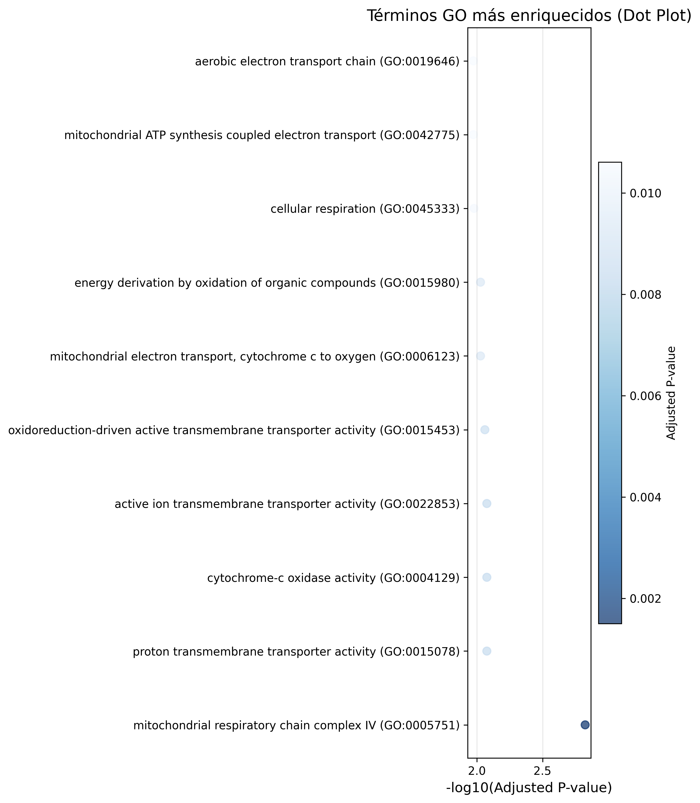

# Análisis Funcional de Genes en Python

#### Anabel Yu Flores Moral

---

Este proyecto se centra en el análisis funcional de tres genes: **COX4I2**, **ND1** y **ATP6**; cuyo correcto funcionamiento es indispensable para la **producción de energía celular (ATP)** a través de la **fosforilación oxidativa** en las **mitocondrias**.

---

## Objetivo

El código `analisis_funcional.py` implementa un **análisis de sobrerrepresentación génica** (ORA) para los genes especificados, utilizando ***Enrichr*** de ***GSEApy***.
Este método consiste en comparar las anotaciones funcionales de los genes del grupo objetivo con las bases de datos GO, con el fin de identificar procesos (por ejemplo, fosforilación oxidativa) significativamente enriquecidos.
El hecho de que un proceso esté enriquecido supone que aparezca con mayor frecuencia de lo esperado por azar.

Para la correcta realización del estudio, se ha considerado **Gene Ontology (GO)** para anotaciones funcionales de genes humanos.
Referencia: Enrichr (Ma'ayan Lab) y GSEApy library.

## Método estadístico

Un método estadístico comúnmente utilizado para este tipo de análisis es la **prueba exacta de Fisher**. Para cada categoría funcional, la proporción de genes del grupo de interés que están anotados con una función determinada se compara con la proporción de genes del grupo de referencia que presentan la misma anotación.
Si la proporción es significativamente mayor en el grupo objetivo, se considera que dicha función está sobrerrepresentada en ese conjunto de genes.

La prueba exacta de Fisher puede expresarse mediante una tabla de contingencia, en la que se contabiliza el número de genes asociados a una categoría funcional específica (por ejemplo, regulación del ciclo celular) dentro de dos conjuntos: el grupo objetivo (genes de interés) y el grupo de fondo (genes de referencia).

#### Grupo de Genes de Interés: 
Lista que se desea estudiar: [`COX4I2`, `ND1`, `ATP6`]. 

#### Grupo de Referencia:
El grupo de referencia utilizado es el genoma humano completo anotado en la base Gene Ontology (GO). El uso del grupo de referencia permite calcular estadísticamente si los términos funcionales están enriquecidos en el subconjunto objetivo, asumiendo un *background* de aproximadamente 20.000 genes humanos para normalizar sesgos. En este script, *Enrichr* usa implícitamente el **proteoma humano** como **referencia para anotaciones GO**.

##### Anotaciones Funcionales:
Son las **etiquetas** de la **Ontología Génica** (GO). Hay miles de términos GO, como "fosforilación oxidativa" (`GO:0006119`), "membrana mitocondrial interna" (`GO:0005743`) o "regulación del ciclo celular" (`GO:0051726`).

---

## Implementación en Python

El script define `analisis_go_ora(genes)`, que invoca `gp.enrichr` con un conjunto de subontologías GO para procesos, funciones y componentes celulares: **GO 2021** (**Biological Process**, **Molecular Function**, **Cellular Component**); especifica al organismo ***Homo sapiens*** para anotaciones humanas/mitocondriales; y el filtro para seleccionar únicamente los términos GO enriquecidos que superan el nivel de significancia estadística (**p-valor ajustado** <= 0.05).
De forma que, al ejecutar el análisis, *Enrichr* devuelve sólo los resultados donde el FDR (False Discovery Rate: métrica estadística que mide la proporción esperada) ≤ 0.05, excluyendo términos no significativos para reducir falsos positivos.

**Enrichr** realiza el **Test de Fisher** internamente y devuelve un DataFrame con términos, p-valores y genes solapados.
Un valor bajo (<0.05) en la anotación funcional indica mayor probabilidad de enriquecimiento real en la lista de genes. Entonces, para la gráfica resultante se ordena por de menor a mayor **p-valor ajustado**. Asimismo, se muestran las 15 anotaciones más enriquecidas para ser visualizadas como un dot plot. Dado que la FDR es un valor pequeño entre 0 y 1 (0.001 para alto enriquecimiento), su escala comprimida hace difícil distinguirlo en ejes; así que el logaritmo lo expande, y el negativo invierte la escala para que valores más bajos de FDR (mayor significancia) produzcan números más altos y positivos: -log10(FDR) en eje x.

---

## Resultados

La salida esperada del script devuelve una representación gráfica y un archivo CSV que contiene los resultados detallados del análisis de sobrerrepresentación génica (ORA).

- **Eje Y (términos)**: Lista los términos GO de mayor a menor significancia (e.g., "mitochondrial electron transport, cytochrome c to oxygen" arriba, relacionado con la cadena respiratoria en COX4I2).
- **Eje X (`-log10(Adjusted P-value)`)**: Mide la significancia estadística; valores más altos a la derecha indican mayor enriquecimiento (p-valores ajustados bajos, e.g., <0.05 para FDR controlado, significando baja probabilidad de azar). Los puntos están cerca del origen debido a la pequeña lista de genes, pero destacan asociaciones mitocondriales reales. 
- **Tamaño de puntos**: Proporcional al conteo de genes solapados.
- **Colores (gradiente azul)**: Más oscuro para mayor significancia (bajos FDR), enfatizando términos como "cellular respiration" y "aerobic electron transport chain", confirmando roles bioenergéticos en la mitocondria.



En la gráfica de dot plot se muestran los 15 procesos biológicos, funciones moleculares y componentes celulares más enriquecidos entre los genes de interés (COX4I2, ND1 y ATP6). Los términos con mayor relevancia: **transporte de electrones mitocondriales** (cytochrome c to oxygen), **respiración celular** y **cadena de transporte aeróbico**; tienen una fuerte implicación en la cadena respiratoria y síntesis de ATP mitocondrial. Esta conclusión subraya la conexión funcional entre los genes y el metabolismo energético oxidativo, resaltando su papel esencial en la generación de energía dentro de la célula.

---

## Estructura del repositorio

```
/analisis-funcional/
├── data/
│   └── genes_input.txt        # Genes proporcionados para el análisis
├── scripts/
│   └── analisis.py            # Script de análisis funcional
│   └── genes.txt              # Lectura de genes para el script
├── results/                   # Resultados generados por el script
│   └── grafico_dotplot.png          
│   └── resultados_enrichr.csv         
├── README.md                  
└── requirements.txt           # Dependencias del proyecto
```

## Dependencias recomendadas
Las librerías neesarias para ejecutar el script se incluyen en `requirements.txt`.

```
gseapy
pandas
numpy
matplotlib.pyplot
os
argparse
```

---

## Referencias

Subramanian, A., & Ma'ayan, A. (2024). GSEApy: Gene Set Enrichment Analysis in Python [Software]. https://gseapy.readthedocs.io

García González, J. (2024). Métodos de enriquecimiento funcional para la interpretación biológica de datos ómicos [Trabajo Fin de Grado, Universidad de Valladolid]. UVaDOC. https://uvadoc.uva.es/bitstream/10324/74184/1/TFG-G7390.pdf

Google. (2025). Gemini: Herramienta de asistencia al código Python y redacción con IA. 

